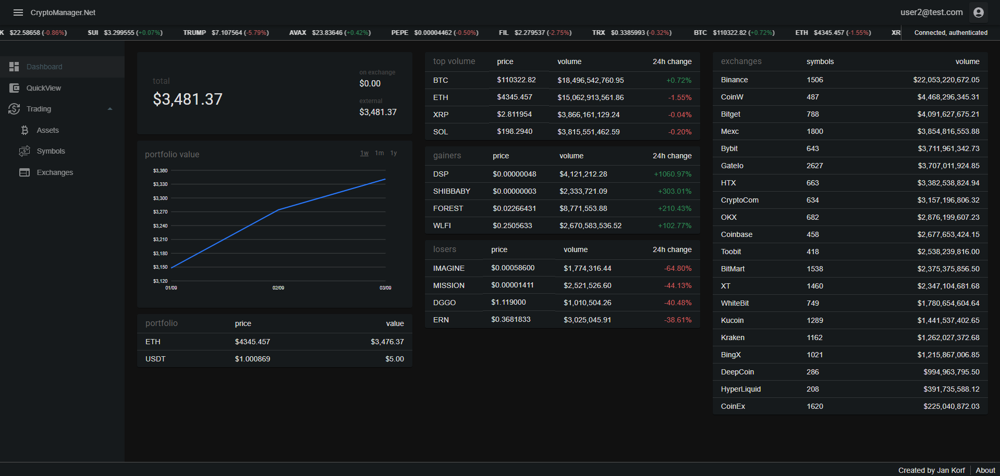
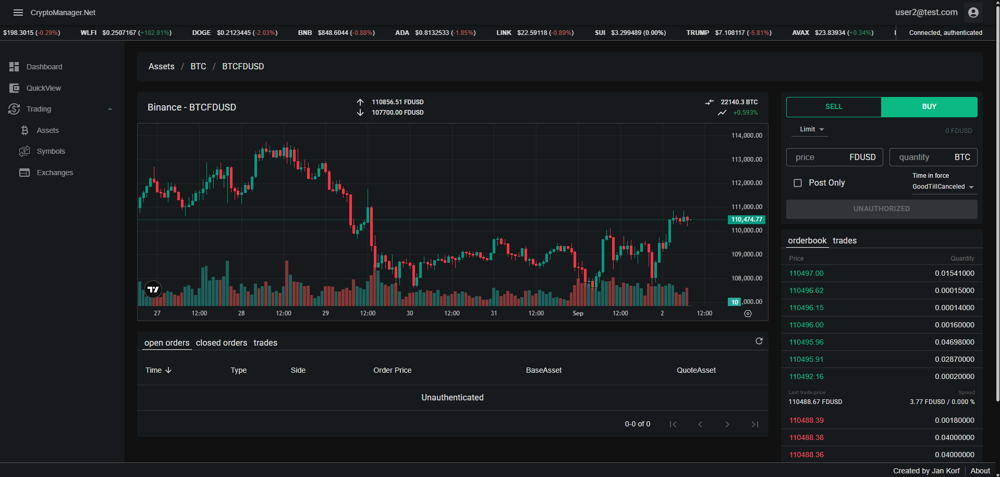
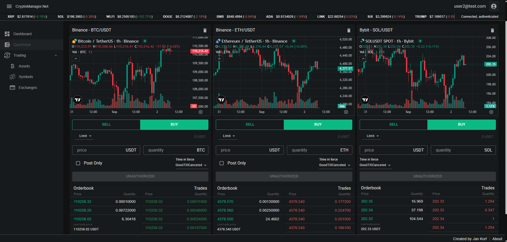
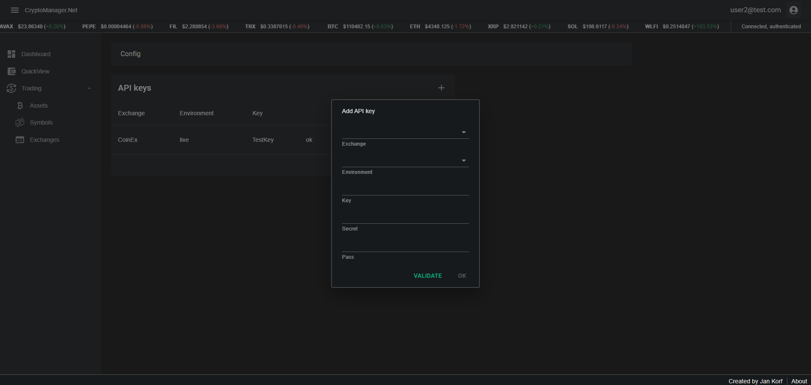

#  CryptoManager.Net  

Demo application for using the open source, free to use CryptoExchange.Net and CryptoClients.Net libraries.  
[Application](https://tracker.jkorf.dev/)  
[CryptoClients.Net library source](https://github.com/JKorf/CryptoClients.Net)  
[Library documentation](https://cryptoexchange.jkorf.dev/)  

## Features
* Live statistics on all assets, symbols and exchanges on supported exchanges
* Data from 22 different exchanges
* Live chart, trades and order book for all symbols
* User authentication/authorization for the application and for exchanges
* Order management for all symbols and exchanges
* QuickView allowing tracking of live data up of up to 8 different symbols simultaneously 

## 
The main purpose of the application is to demo the possibilities of the used libraries.  
You're free to use the application but no responsibility is assumed for losses due to bugs or any other reason.

##

<i>Dashboard</i>
  

  

<i>Symbol view</i>
  

  

<i>Quick view</i>
  

  

<i>API key management</i>
  

  

## Contact
If you have feedback, questions or want to report a bug feel free to open a GitHub issue or send me an email at contact@jkorf.dev.